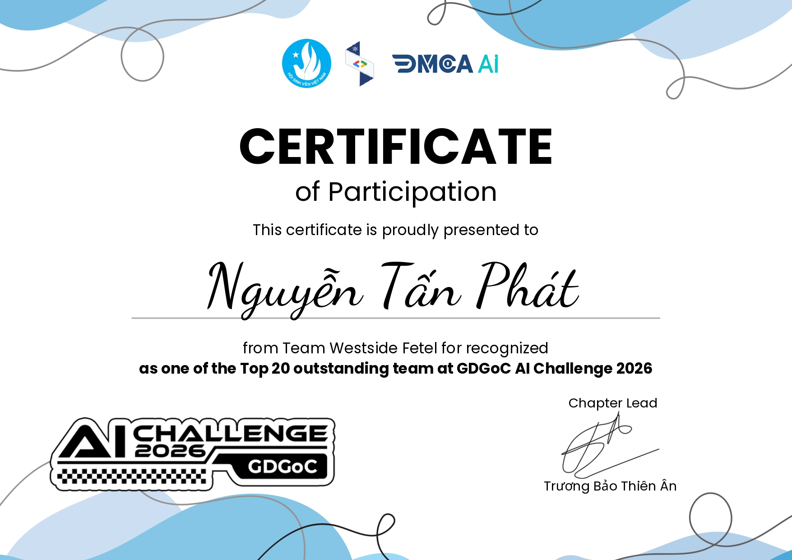

<div align="center">
  
  
  
  
</div>

<h1 align="center">💣 Bomberland - GDGoC HCMUS AI Challenge 2026</h1>
<h3 align="center">Team: Westside Fetel</h3>

<p align="center">
  
  
</p>

<p align="center">
  <b>This repository contains the source code for our AI Agent that achieved Top 9 Global in the GDGoC HCMUS AI Challenge (Bomberland). We missed the Grand Finals (Top 8) by merely 0.04 TrueSkill points!</b>
</p>

---

## 🏆 The Journey & Story
In this 4-player Battle Royale Bomberland game, agents must collect power-ups, break wooden boxes, and blow up opponents while avoiding their own death. 

Our agent started as a basic rule-based bot but quickly evolved into an extremely aggressive, frame-perfect pathfinding AI. Through rigorous iterations, we optimized our **A* Search algorithm** to calculate safe routes within the strict **<100ms** inference limit, avoiding server-side crashes (STOP actions). Our most successful variant (**V20 - The Honored One**) played over 300 matches on the global server, achieving a staggering **53.18% Win Rate** and cementing our position at **Rank #9 Global**.

We missed the Grand Finals ticket by a microscopic gap of **0.04 TrueSkill Score** (111.93 vs 111.97). This repository is a showcase of our technical problem-solving, algorithm optimization, and meta-game exploitation.

---

## 🧠 Core Technical Highlights

What makes our agent unique is its ability to bypass performance bottlenecks and exploit the engine's meta-game scoring rules.

### 1. The 7-Layer Behavior Tree (Priority Decision-making)
Instead of deep Reinforcement Learning (which is unpredictable and slow), we engineered a deterministic, layered priority tree. Every tick, the agent evaluates the grid and makes decisions based on 7 critical layers (ranging from immediate survival to strategic tie-breaker exploits).
👉 *See [docs_ai/ARCHITECTURE.md](docs_ai/ARCHITECTURE.md) for full algorithmic details.*

### 2. Overcoming the 100ms Inference Limit
A standard A* algorithm running across a large grid with multiple enemies causes timeouts, resulting in the bot freezing. We optimized our A* by:
- Implementing strict `max_d` limits (Radar clipping).
- Using Target Slicing (only calculating routes for the Top 10 highest-value coordinates).
- Eliminating overlapping searches.

### 3. Minimax Threat Modeling & Survival Instinct
The agent constantly maps the grid for potential bomb placements from enemies within a 4-tile radius, assuming the worst-case scenario. It uses a custom **Temporal Escape (BFS)** function to calculate a 3D space-time matrix, finding tiles that will be safe when the bomb detonates.

### 4. Meta-Game Exploitations (Hacking the Tie-Breaker)
The game engine handles ties at Step 500 by ranking players based on: `Kills > Boxes > Items > Bombs Placed`.
Our AI features a **Late-game Frenzy Mode**: If `step > 350`, it prioritizes breaking boxes exponentially higher. If `step > 420` and the agent is safe but idle (no reachable enemies), it deliberately drops bombs in safe corners to rack up the "Bombs Placed" metric, ensuring victory in any Tie-breaker.

---

## 🗺️ How to Navigate This Repository

If you are a recruiter, an AI enthusiast, or just curious about our solution, here is the recommended path to explore this project:

**1. 📖 Start with the Logic:**
Before diving into the code, check out [`docs_ai/ARCHITECTURE.md`](docs_ai/ARCHITECTURE.md). This document explains our core brain: The 7-Layer Behavior Tree and how we optimized the A* algorithm.

**2. 💻 Jump to the Winning Code:**
Don't get lost in the old versions! Go straight to **`agent/my_agent_v20/`** (The Honored One). This is the exact code that secured our Top 9 Global rank. 
*   *Tip:* Pay special attention to the `agent.py` file to see our target-slicing and Temporal Escape BFS implementation.

**3. ⚔️ See the Meta-hacks:**
Take a look at **`agent/my_agent_v24/`** (The True King) to see our experimental "Late-game Frenzy Mode" where we manipulated the game's tie-breaker rules (farming boxes and spamming safe bombs when idle).

**4. 🔄 Explore the Evolution (Quá trình thử nghiệm):**
Want to see how we grew? Browse the `agent/archive_old_versions/` directory to see our journey from a basic bot that kept crashing (Timeout) to a highly optimized agent.

> **Our Development Journey (From Zero to Top 9):**
> * **V1 - V9 (The Struggle):** Started with basic rule-based logic. The bot constantly suffered from timeouts, suicidal bomb placements, and getting stuck in corners.
> * **V10 - V19 (The A* Breakthrough):** A major turning point. We spent countless nights debugging the A* pathfinding algorithm and BFS (Breadth-First Search) for safety scanning. The bot finally learned how to "dodge bombs" to survive, but it still lacked effective attacking capabilities.
> * **V20 - V21 (The Honored One):** The algorithmic peak. We rebuilt everything from scratch using a "7-Layer Behavior Tree" architecture. The bot could seamlessly switch between Fleeing, Hunting, and Wood-Farming depending on the context. V20 officially secured our Top 9 Global rank.
> * **V22 - V23 (The Icarus Trap - Over-engineering):** We got too ambitious. Trying to break our own limits, we added hyper-optimized pathfinding and complex enemy prediction. It backfired completely—causing the bot to overthink, freeze, and make fatal errors. A painful lesson that sometimes, over-optimizing leads to nothing.
> * **V24 (The True King):** Pushing beyond standard game programming to play the "Meta-game". Upon discovering the Tie-breaker rule (ties are decided by points), we implemented a "Frenzy Mode" - optimizing the auto-farming mechanism in the late game to secure victories through raw points.
> 
> *Our most valuable lesson wasn't about finding the perfect algorithm from day one, but the persistence in analyzing logs from hundreds of failed matches, and continuously tearing down and rebuilding our architecture to optimize every millisecond of processing time.*

*(Note: We only kept `submission_v20.zip`, `submission_v21.zip`, and `submission_v24.zip` in the root folder as our official compiled tournament submissions. The rest were cleaned up for readability.)*

---

## 🤝 Team & Contributions

This project was a collaborative effort. We split the workload to move fast, and both of us used AI tools to speed up the coding process.

* **Nguyễn Tấn Phát (Project Lead):** Guided the overall project direction and ideas. Responsible for setting up the GitHub repository, CI/CD, game engine integration, and the testing environment. Also proposed the first algorithmic approaches and used AI to quickly build the early baseline models, which set a strong foundation for the team.
* **Hoàng Kim Phát Tài (Core Algorithm Developer):** Focused on designing the detailed AI logic, specifically the 7-Layer Behavior Tree. Worked closely with AI models to write complex algorithms like A* pathfinding and BFS. Spent a lot of time debugging AI-generated code to fix server timeouts and make the tie-breaker strategies work.


---

### How to Run (Local Simulation)
1. Install dependencies: `pip install -r requirements.txt`
2. Run a match using our Top 9 agent:
```bash
python main.py --agent agent/my_agent_v20 --players 4 --render
```
